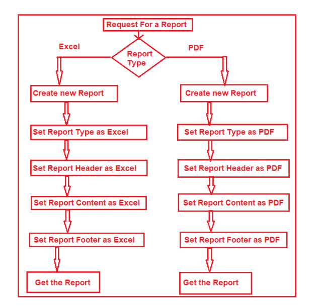

# Builder Design Pattern

- According to GOF, the Builder Design Pattern builds a complex object using many simple objects and a step-by-step approach. The Process of constructing the complex object should be so generic that the same construction process can be used to create different representations of the same complex object.

